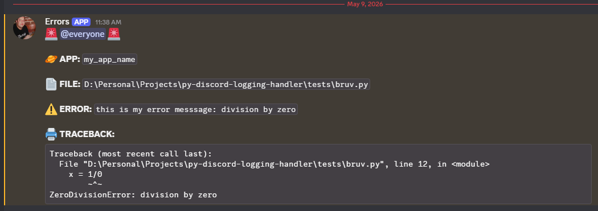
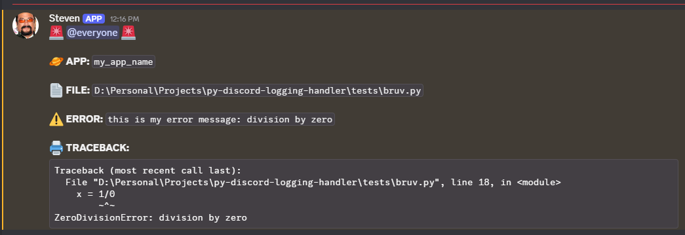
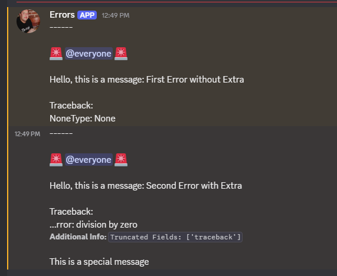

# py-discord-logging-handler

Out of the box, highly customizable, discord logging handler that supports multiple logger libraries.


---

py-discord-logging-handler is a package that helps you save your logs as discord messages.
It uses Discord's API to send webhooks with a nicely formatted logging information.

This is a perfect package if you need a simple error logging for your side project.

The key features are:

- **Fast and no dependencies:** Because there are no dependencies and the code is simple the handlers work superfast
- **Out of the box usage:** No need to waste time setting it up. You can just start using it.
- **Third parties loggers support:** The package supports built-in logging module as well as loguru and structlog
- **Highly customizable:** You can customize the data and the format of the final logging message

This package is **not** an official product by Discord Inc.

---

## Installation

```bash
$ pip install py_discord_logging_handler
```

## Quickstart

Code:
```python
from py_discord_logging_handler import add_discord_logging_handler, DiscordHandlerInputData
from logging import getLogger

logger = getLogger(__file__)
input_data = DiscordHandlerInputData(
    app_name="my_app_name",
    webhook_url="https://discord.com/api/webhooks/my_id/my_token"
)
add_discord_logging_handler(logger, input_data)

try:
    x = 1/0
except Exception as e:
    logger.error(f"this is my error message: {e}")
```
Result:



## Discord API limitations

Before we make a deeper dive, we need to mention that the maximum length of a message
that is sent using a discord webhook is currently 2000 characters. 
Sending a webhook above that limit will result in no message.
This might be problematic for some cases, but this package has a system of truncation of specified fields.
So, for example, by default we allow the traceback field to be no longer than 900 characters.
In addition to this, we will always make sure that a message has max of 2k characters, but more on that later.

## Package Usage Guide

### Creating a Discord webhook

In the Discord app navigate through: `Server Settings` -> `Apps` -> `Integrations` -> `Webhooks` -> `New Webhook`

Then specify a name, channel and an avatar of that webhook app. Copy the webhook URL.

### Setting the Discord webhook URL.

To specify the webhook you must use one of the 4 options:
- `webhook_url` in the `DiscordHandlerInputData` object
- `webhook_id` and `webhook_token` in the `DiscordHandlerInputData` object
- `DISCORD_LOGGING_HANDLER_WEBHOOK_URL` ENV variable
- `DISCORD_LOGGING_HANDLER_WEBHOOK_ID` and `DISCORD_LOGGING_HANDLER_WEBHOOK_TOKEN` ENV variables

The final webhook URL should look like this:
`https://discord.com/api/webhooks/<your_webhook_id>/<your_webhook_token>`

In other words, you can either specify the whole URL or just the ID and the token.

### Traceback

You can see the traceback in your message only if the logger logs inside the `exception` clause.

### Default Logger
```python
from py_discord_logging_handler import add_discord_logging_handler, DiscordHandlerInputData, DiscordLoggingHandler
from logging import getLogger

# 1) Get a logger
logger = getLogger(__file__)

# 2) Prepare the input data 
input_data = DiscordHandlerInputData(
    app_name="my_app_name",
    webhook_url="https://discord.com/api/webhooks/my_id/my_token"
)

# 3) Run the main method to add the handler
add_discord_logging_handler(logger, input_data)

# you can also do this:
logger2 = getLogger("logger2")
handler = DiscordLoggingHandler(input_data)
handler.setLevel(int(input_data.logging_level))
logger2.addHandler(handler)

try:
    x = 1/0
except Exception as e:
    logger.error(f"this is my error message: {e}")
```

### Loguru Logger
```python
from py_discord_logging_handler import add_discord_logging_handler, DiscordHandlerInputData, discord_loguru_handler_wrapper
from loguru import logger

# 1) Prepare the input data 
input_data = DiscordHandlerInputData(
    app_name="my_app_name",
    webhook_url="https://discord.com/api/webhooks/my_id/my_token"
)

# 2) Run the main method to add the handler
add_discord_logging_handler(logger, input_data)

# you can also do this:
logger.add(discord_loguru_handler_wrapper(input_data), level=input_data.logging_level.name)

try:
    x = 1/0
except Exception as e:
    logger.error(f"this is my error message: {e}")
```

### Structlog
```python
from py_discord_logging_handler import discord_structlog_processor_wrapper, DiscordHandlerInputData
import structlog

# 1) Prepare the input data 
input_data = DiscordHandlerInputData(
    app_name="my_app_name",
    webhook_url="https://discord.com/api/webhooks/my_id/my_token"
)

# 2) Add a handler 
structlog.configure(
    processors=[
        discord_structlog_processor_wrapper(input_data),
    ],
)

# 3) Get the logger
logger = structlog.get_logger()

try:
    x = 1/0
except Exception as e:
    logger.error(f"this is my error message: {e}")
```

### Input data optional fields

You can override some of the default behavior using the input data fields:

```python
from py_discord_logging_handler import add_discord_logging_handler, DiscordHandlerInputData, DiscordLoggingHandlerLevel
from logging import getLogger

logger = getLogger(__file__)
input_data = DiscordHandlerInputData(
    app_name="my_app_name", # name of the app/service
    webhook_url="https://discord.com/api/webhooks/my_id/my_token", # webhook url,
    avatar_url="https://fwcdn.pl/ppo/00/98/98/451001_1.3.jpg", # override the default webhook avatar with Steven Seagal
    username="Steven", # override the default webhook name
    add_additional_data_to_content=False, # This will show which fields were truncated if they are above their limit
    # enum of the minimum logging level that the handle should support. So, if the level is ERROR, then
    # the handler will be run on the ERROR level and CRITICAL level, because CRITICAL is higher
    logging_level=DiscordLoggingHandlerLevel.ERROR
)

add_discord_logging_handler(logger, input_data)
try:
    x = 1/0
except Exception as e:
    logger.error(f"this is my error message: {e}")
```

Result:



### Creating a custom message template and truncation

You can change the default message style and the fields that it uses. You can also change the truncation.

The additional fields will be fed by the `extra` argument when creating a log.

First, you need to specify a new dataclass with the new fields. Let's create a dataclass that has
a `is_the_message_important` attribute. Based on that we will add a special string to the final message.
By default, let it be `False`.
```python
from dataclasses import dataclass
from py_discord_logging_handler.models import BaseContentData

@dataclass
class CustomContentData(BaseContentData):
    is_the_message_important: bool = False
```

Now, let's create a MessageTemplateBuilder.

This class will return a list of strings, ordered by importance. The package will later take this list and
gradually add the strings to the final message. If any part does not fit into the 2k character limit,
it will be truncated.

```python
from py_discord_logging_handler.message_template_builder import BaseMessageTemplateBuilder
from typing import List

class CustomMessageTemplateBuilder(BaseMessageTemplateBuilder[CustomContentData]):
    FIELD_LENGTH_LIMITS = {
        "traceback": 20,
    }
    PARTS_CONCATENATION_CHARACTER: str = "\n\n"

    @staticmethod
    def build_message_parts(data: CustomContentData) -> List[str]:
        """Parts are ordered by importance"""
        parts = [
            f"------",
            f"{data.alert_emoji} {data.ping} {data.alert_emoji}",
            f"Hello, this is a message: {data.message}",
            f"Traceback:\n{data.traceback if data.traceback is not None else 'None'}"
            f"{f'-# **Additional Info:** `{data.additional_info}`' if data.additional_info else ''}",
        ]
        if data.is_the_message_important:
            parts.append("This is a special message")
        return parts
```

The method is pretty straightforward.

When it comes to `FIELD_LENGTH_LIMITS` - we can specify the maximum length of a field before it is
read in the `build_message_parts` method. Tho showcase the truncation system, we made the traceback
have maximum of 20 characters.

The `PARTS_CONCATENATION_CHARACTER` specifies a character which will concatenate the parts together.

We have everything we need so let's use it in practice.

We need to specify the `content_dataclass_type`, `content_dataclass_additional_fields` and `message_template_builder_type`

```python
from py_discord_logging_handler import add_discord_logging_handler, DiscordHandlerInputData, DiscordLoggingHandler
from logging import getLogger
logger = getLogger(__file__)

input_data = DiscordHandlerInputData(
    app_name="my_app_name",
    webhook_url="https://discord.com/api/webhooks/my_id/my_token",
    content_dataclass_type=CustomContentData, # our new custom dataclass
    content_dataclass_additional_fields=["is_the_message_important"], # extra fields we added
    message_template_builder_type=CustomMessageTemplateBuilder # the custom builder
)
add_discord_logging_handler(logger, input_data)

# log with traceback and no extra argument
logger.error("First Error without Extra")

# log with traceback and extra argument
try:
    x = 1/0
except Exception as e:
    logger.error(f"Second Error with Extra", extra={"is_the_message_important": True})
```

Result:



As you can see, we got two messages. The first one has no traceback because it is not inside `except` clause.
It also does not have our extra argument.

In the second one the traceback got truncated the way we wanted.

## Future Development

Future features/plans include:
- Supporting more loggers
- Improving the format of the message